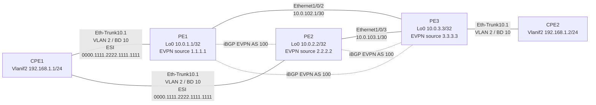

# Lab EVPN L2 - 17-11-2025

Consolidação das linhas de configuração do laboratório, estruturadas por equipamento a partir do arquivo `config lab-evpn-l2 - 17-11-2025.txt`.

## Topologia Inferida

O laboratório implementa uma extensão de camada 2 sobre EVPN/MPLS na VPN instance `evpna`, usando a `bridge-domain 10` e a VLAN `2`. Os equipamentos `PE1` e `PE2` formam um par de multihoming EVPN para o `CPE1`, enquanto o `PE3` faz a terminação do mesmo domínio de broadcast em direção ao `CPE2`.



## Observações

- O conteúdo abaixo foi reorganizado para facilitar leitura e reaplicação da configuração final.
- A topologia foi inferida a partir do endereçamento IP, dos `e-trunk`, dos `ESI` e dos vizinhos BGP EVPN presentes no arquivo de origem.
- Prompts dos equipamentos, separadores visuais, `commit`, `return` e interfaces sem configuração relevante para o serviço foram omitidos.
- Onde o arquivo fonte mostra diretamente a configuração final, os blocos abaixo preservam as linhas essenciais, apenas com melhor organização e espaçamento.

## PE1

### Base EVPN, BD e MPLS

```text
system-view immediately

sysname PE1

lacp e-trunk system-id 00e0-fc00-0000
lacp e-trunk priority 1

evpn
 vlan-extend private enable
 vlan-extend redirect enable
 local-remote frr enable
 mac-duplication
quit

evpn vpn-instance evpna bd-mode
 route-distinguisher 100:1
 vpn-target 1:1 export-extcommunity
 vpn-target 1:1 import-extcommunity
quit

bridge-domain 10
 evpn binding vpn-instance evpna
quit

mpls lsr-id 10.0.1.1

mpls
quit

mpls ldp
 ipv4-family
quit

evpn source-address 1.1.1.1
```

### Acesso EVPN Multihoming

```text
e-trunk 1
 peer-address 2.2.2.2 source-address 1.1.1.1
quit

interface Eth-Trunk10
 mode lacp-static
 e-trunk 1
 e-trunk mode force-master
 esi 0000.1111.2222.1111.1111
quit

interface Eth-Trunk10.1 mode l2
 encapsulation dot1q vid 2
 rewrite pop single
 bridge-domain 10
quit
```

### Underlay e Controle

```text
interface Ethernet1/0/2
 undo shutdown
 ip address 10.0.102.1 255.255.255.252
 ospf enable 1 area 0.0.0.0
 mpls
 mpls ldp
 undo dcn mode vlan
quit

interface LoopBack0
 ip address 10.0.1.1 255.255.255.255
 ospf enable 1 area 0.0.0.0
quit

ospf 1 router-id 10.0.1.1
 area 0.0.0.0
quit

bgp 100
 peer 10.0.2.2 as-number 100
 peer 10.0.2.2 connect-interface LoopBack0
 peer 10.0.3.3 as-number 100
 peer 10.0.3.3 connect-interface LoopBack0

 ipv4-family unicast
  undo synchronization
  peer 10.0.2.2 enable
  peer 10.0.3.3 enable
 quit

 l2vpn-family evpn
  undo policy vpn-target
  peer 10.0.2.2 enable
  peer 10.0.3.3 enable
 quit
quit
```

## PE2

### Base EVPN, BD e MPLS

```text
system-view immediately

sysname PE2

lacp e-trunk system-id 00e0-fc00-0000
lacp e-trunk priority 1

evpn
 vlan-extend private enable
 vlan-extend redirect enable
 local-remote frr enable
 mac-duplication
quit

evpn vpn-instance evpna bd-mode
 route-distinguisher 200:1
 vpn-target 1:1 export-extcommunity
 vpn-target 1:1 import-extcommunity
quit

bridge-domain 10
 evpn binding vpn-instance evpna
quit

mpls lsr-id 10.0.2.2

mpls
quit

mpls ldp
 ipv4-family
quit

evpn source-address 2.2.2.2
```

### Acesso EVPN Multihoming

```text
e-trunk 1
 peer-address 1.1.1.1 source-address 2.2.2.2
quit

interface Eth-Trunk10
 mode lacp-static
 e-trunk 1
 e-trunk mode force-master
 esi 0000.1111.2222.1111.1111
quit

interface Eth-Trunk10.1 mode l2
 encapsulation dot1q vid 2
 rewrite pop single
 bridge-domain 10
quit
```

### Underlay e Controle

```text
interface Ethernet1/0/3
 undo shutdown
 ip address 10.0.103.1 255.255.255.252
 ospf enable 1 area 0.0.0.0
 mpls
 mpls ldp
 undo dcn mode vlan
quit

interface LoopBack0
 ip address 10.0.2.2 255.255.255.255
 ospf enable 1 area 0.0.0.0
quit

ospf 1 router-id 10.0.2.2
 area 0.0.0.0
quit

bgp 100
 peer 10.0.1.1 as-number 100
 peer 10.0.1.1 connect-interface LoopBack0
 peer 10.0.3.3 as-number 100
 peer 10.0.3.3 connect-interface LoopBack0

 ipv4-family unicast
  undo synchronization
  peer 10.0.1.1 enable
  peer 10.0.3.3 enable
 quit

 l2vpn-family evpn
  undo policy vpn-target
  peer 10.0.1.1 enable
  peer 10.0.3.3 enable
 quit
quit
```

## PE3

### Base EVPN, BD e MPLS

```text
system-view immediately

sysname PE3

lacp e-trunk system-id 00e0-fc00-3333
lacp e-trunk priority 1

evpn vpn-instance evpna bd-mode
 route-distinguisher 300:1
 vpn-target 1:1 export-extcommunity
 vpn-target 1:1 import-extcommunity
quit

bridge-domain 10
 evpn binding vpn-instance evpna
quit

mpls lsr-id 10.0.3.3

mpls
quit

mpls ldp
 ipv4-family
quit

e-trunk 1
quit

evpn source-address 3.3.3.3
```

### Acesso ao Domínio L2

```text
interface Eth-Trunk10
 mode lacp-static
 e-trunk 1
 e-trunk mode force-master
 esi 004c.1fcc.f95d.e30a.3100
quit

interface Eth-Trunk10.1 mode l2
 encapsulation dot1q vid 2
 rewrite pop single
 bridge-domain 10
quit

interface Ethernet1/0/0
 undo shutdown
 eth-trunk 10
 undo dcn
 undo dcn mode vlan
quit

interface Ethernet1/0/1
 undo shutdown
 undo dcn
 undo dcn mode vlan
quit
```

### Underlay e Controle

```text
interface Ethernet1/0/2
 undo shutdown
 ip address 10.0.102.2 255.255.255.252
 ospf enable 1 area 0.0.0.0
 mpls
 mpls ldp
 undo dcn mode vlan
quit

interface Ethernet1/0/3
 undo shutdown
 ip address 10.0.103.2 255.255.255.252
 ospf enable 1 area 0.0.0.0
 mpls
 mpls ldp
 undo dcn mode vlan
quit

interface LoopBack0
 ip address 10.0.3.3 255.255.255.255
 ospf enable 1 area 0.0.0.0
quit

ospf 1 router-id 10.0.3.3
 area 0.0.0.0
quit

bgp 100
 peer 10.0.1.1 as-number 100
 peer 10.0.1.1 connect-interface LoopBack0
 peer 10.0.2.2 as-number 100
 peer 10.0.2.2 connect-interface LoopBack0

 ipv4-family unicast
  undo synchronization
  peer 10.0.1.1 enable
  peer 10.0.2.2 enable
 quit

 l2vpn-family evpn
  undo policy vpn-target
  peer 10.0.1.1 enable
  peer 10.0.2.2 enable
 quit
quit
```

## CPE1

### VLAN, Gateway e Eth-Trunk

```text
system-view immediately

sysname CPE1

vlan batch 2

interface Vlanif2
 ip address 192.168.1.1 255.255.255.0
quit

interface Eth-Trunk10
 portswitch
 port link-type trunk
 port trunk allow-pass vlan 2
 mode lacp-static
quit

interface Ethernet1/0/1
 undo shutdown
 eth-trunk 10
 undo dcn
 undo dcn mode vlan
quit

interface Ethernet1/0/2
 undo shutdown
 eth-trunk 10
 undo dcn mode vlan
quit
```

## CPE2

### VLAN, Gateway e Eth-Trunk

```text
system-view immediately

sysname CPE2

vlan batch 2

interface Vlanif2
 ip address 192.168.1.2 255.255.255.0
quit

interface Eth-Trunk10
 portswitch
 port link-type trunk
 port trunk allow-pass vlan 2
 mode lacp-static
quit

interface Ethernet1/0/0
 undo shutdown
 eth-trunk 10
 undo dcn
 undo dcn mode vlan
quit
```
